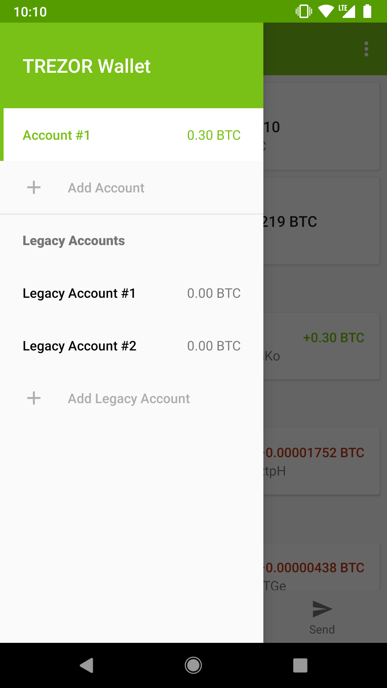
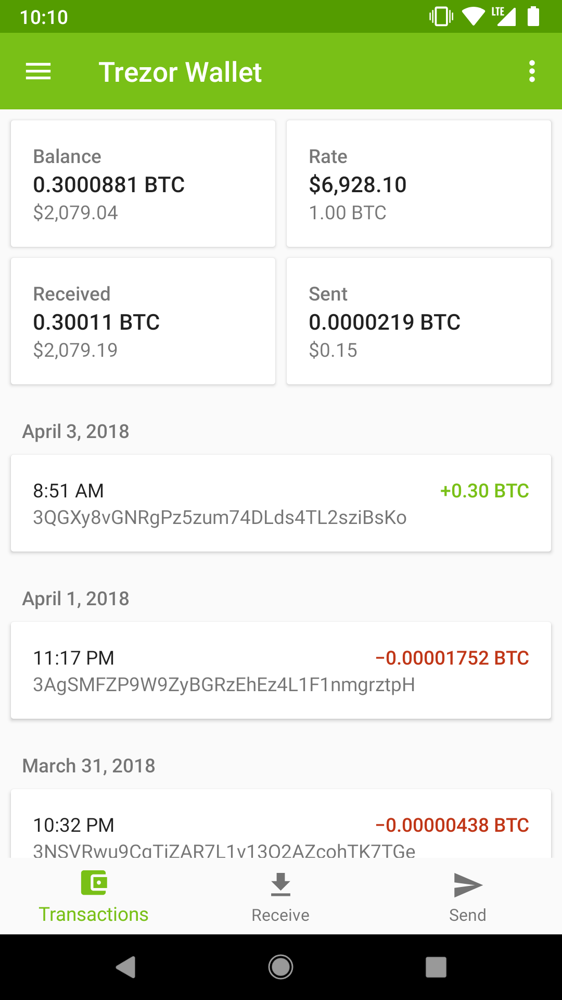
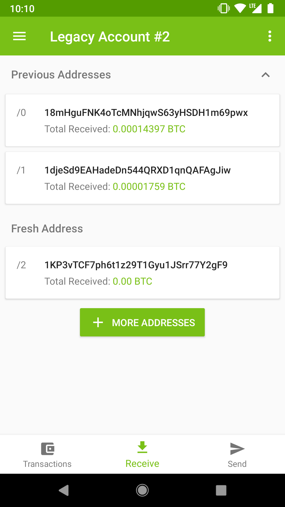
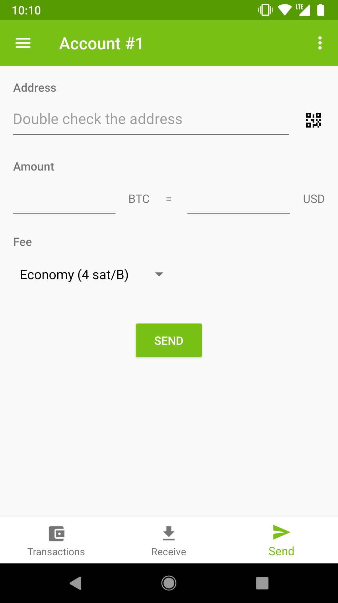

# TREZOR Bitcoin Wallet for Android

## Features

- Import both SegWit and legacy accounts, load transaction history and keep track of the balance
- Create a transaction, sign it with TREZOR and broadcast to the network
- Account, address and transaction labeling compatible with SLIP-0015 standard
- TREZOR One and TREZOR Model T support

## Known Issues
- Can't send transactions from SegWit accounts

## Build
Install the debug build:
`./gradlew installDebug`

Run unit tests:
`./gradlew test`

## Screenshots
   

## Used Libraries
[trezor-android](https://github.com/MattSkala/trezor-android) – TREZOR communication

[Bouncy Castle](https://www.bouncycastle.org/) – cryptography API

[QRGen](https://github.com/kenglxn/QRGen) – QR code generation

[Retrofit](http://square.github.io/retrofit/) – REST API communication

[Kodein](https://github.com/Kodein-Framework/Kodein-DI/) – dependency injection

[Dropbox SDK](https://github.com/dropbox/dropbox-sdk-java) – labels synchronization

## APIs
[Insight API](https://github.com/bitpay/insight-api) – transactions fetching and fee estimation

[CoinMarketCap](https://coinmarketcap.com/api/) – exchange rate

